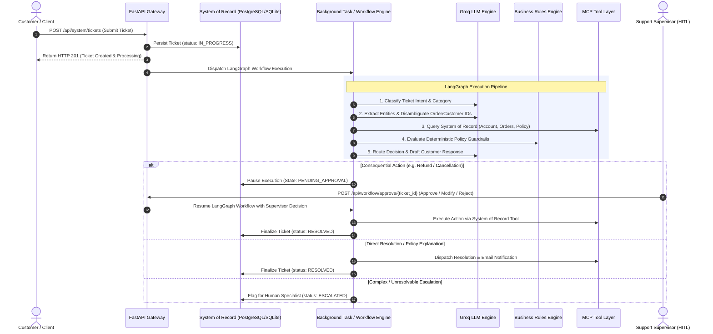
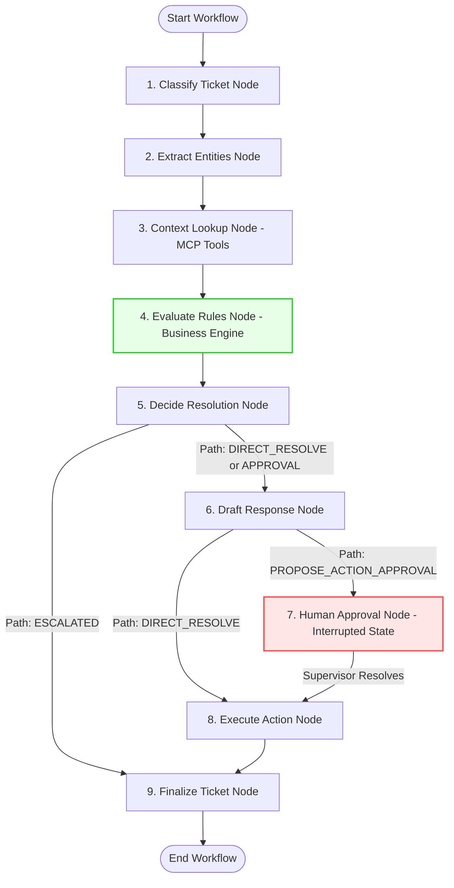

# NovaDesk AI — Enterprise Customer Support & Autonomous Resolution Engine

An enterprise-grade, agentic AI customer support system designed for end-to-end ticket lifecycle automation—from intelligent issue understanding and multi-source context lookup to deterministic policy enforcement and Human-in-the-Loop (HITL) verified action execution.

Built with **FastAPI**, **LangGraph**, **PostgreSQL (Neon)** / **SQLite**, **Groq LLM Engine**, and **Model Context Protocol (MCP)** tools.

---

## 🌟 Key Features

- **⚡ Immediate Asynchronous Ingestion (`FastAPI BackgroundTasks`)**
  - Instant client response (`HTTP 200/201`) upon ticket submission with status `in_progress`.
  - Non-blocking autonomous workflow execution running in background tasks (ready for scalable Redis/Celery queue migration).

- **🤖 Stateful Agentic Workflow (`LangGraph`)**
  - Structured multi-node DAG graph handling ticket classification, intent recognition, entity extraction, context hydration, policy check, decision routing, response drafting, and execution.

- **🛡️ Zero-Hallucination Policy & Deterministic Guardrails (`BusinessRulesEngine`)**
  - Strictly enforces business rules prior to LLM decision-making:
    - **30-Day Return/Refund Policy Gating**.
    - **24-Hour Duplicate Charge Detection**.
    - **Automatic Safety Escalation** for VIP customers, high financial values, or unverified claims.

- **🧑‍💼 Human-in-the-Loop (HITL) Safety Checkpoints**
  - High-impact or consequential actions (e.g., initiating refunds, subscription cancellations, billing updates) pause execution at state interrupts (`PENDING_APPROVAL`).
  - Support operators review, approve, modify, or reject action cards in real-time via the Operations Dashboard.

- **💻 Dual-Interface Web Dashboard**
  - **Customer Portal (`/customer`)**: Submit tickets, track live resolution status with auto-polling, and inspect interactive agent response threads.
  - **Support Operations Dashboard (`/agent`)**: Comprehensive supervisor command center to monitor live state traces, view system-of-record state, and process HITL approvals.

- **🔄 Resilient Model Fallback Strategy**
  - Multi-tier LLM fallback handler supporting primary high-capacity models (e.g., `llama-3.3-70b-versatile`) with automatic failover to fallback models (`qwen-2.5-72b`, `llama-3.1-8b-instant`, `groq/compound`) upon rate limits or API outages.

- **📊 Benchmark & Evaluation Suite**
  - Built-in automated evaluation framework (`POST /api/workflow/evaluate`) testing routing accuracy, policy compliance, entity extraction precision, and safety gating across benchmark scenarios.

---

## 📐 Architecture & System Design

### 1. High-Level Data Flow



---

### 2. LangGraph State Machine Workflow



---

### 3. Component Layers

- **API Layer (`app/api/`)**: Provides RESTful endpoints for ticket submission, system of record management (customers, orders, accounts), and workflow controls.
- **Workflow State Machine (`app/workflow/`)**: Compiles the LangGraph execution graph, manages graph memory checkpointer snapshots, and handles workflow pause/resume hooks.
- **Deterministic Rules Engine (`app/engine/rules_engine.py`)**: Executes rigid policy checks (date windows, order status validation, duplicate claim windows) prior to automated resolution decisions.
- **LLM Client & Resilience Layer (`app/engine/llm_client.py`)**: Wraps LLM requests with structured JSON parsing, prompt templates, retry mechanisms, and multi-model fallback routines.
- **MCP Tool Bridge (`app/tools/mcp_tools.py`)**: Implements Model Context Protocol pattern functions for fetching customer accounts, querying order history, checking return eligibility, executing refunds, and canceling subscriptions.
- **Database & Persistence (`app/db/`)**: Dual-support Async SQLAlchemy engine configured for Neon PostgreSQL (cloud) or SQLite (local development with `aiosqlite`).

---

## 🛠️ Tech Stack

| Category | Technology / Library | Purpose in NovaDesk |
| :--- | :--- | :--- |
| **Backend Framework** | [FastAPI](https://fastapi.tiangolo.com/) | High-performance async REST API framework & OpenAPI generation |
| **ASGI Server** | [Uvicorn](https://www.uvicorn.org/) | Async server implementation for handling concurrent HTTP requests |
| **Orchestration & Graph** | [LangGraph](https://python.langchain.com/docs/langgraph/) / [LangChain](https://www.langchain.com/) | Agent state machine, checkpoint memory, conditional routing, and HITL interrupts |
| **LLM Provider** | [Groq](https://groq.com/) | High-throughput LLM inference engine supporting Llama 3.3 70B & Qwen models |
| **Database ORM** | [SQLAlchemy 2.0](https://www.sqlalchemy.org/) (Async) | Unified async ORM for database entity models and query execution |
| **Database Drivers** | `asyncpg` / `aiosqlite` | Production-ready drivers for PostgreSQL (Neon) and local SQLite fallback |
| **Data Validation** | [Pydantic v2](https://docs.pydantic.dev/) | Strict schema validation for API payloads, state objects, and LLM structured outputs |
| **Frontend UI** | HTML5 / Modern CSS / Vanilla JavaScript | Responsive Dual-Interface Web Dashboard (Customer Portal & Operations Agent Center) |
| **Testing & Evaluation** | [pytest](https://docs.pytest.org/) / `pytest-asyncio` | Automated unit tests, integration test suite, and benchmark workflow evaluator |

---

## 📂 Directory Structure

```text
Customer_Support_Agent/
├── app/
│   ├── api/
│   │   ├── routes_system_record.py   # System of Record CRUD API (Customers, Orders, Tickets)
│   │   └── routes_workflow.py        # Ticket processing, HITL approvals & evaluation endpoints
│   ├── db/
│   │   ├── database.py               # Async SQLAlchemy engine & session manager (Neon/SQLite)
│   │   ├── models.py                 # DB Schema (Customer, Order, Ticket, Refund, AuditLog)
│   │   └── seed_data.py              # Synthetic realistic seed generator for evaluation
│   ├── engine/
│   │   ├── llm_client.py             # Groq LLM client with structured JSON & fallback handler
│   │   └── rules_engine.py           # Deterministic business rules & compliance evaluation
│   ├── evaluation/
│   │   └── evaluate.py               # Benchmark test suite runner & metric reporting
│   ├── static/
│   │   ├── index.html                # Single-Page App layout (Customer & Agent views)
│   │   ├── style.css                 # Custom CSS design system (Dark/Light responsive theme)
│   │   └── app.js                    # Reactive frontend controller & polling logic
│   ├── tools/
│   │   └── mcp_tools.py              # Model Context Protocol (MCP) Tool handlers
│   ├── workflow/
│   │   ├── graph.py                  # LangGraph DAG definition, routes, and WorkflowRunner
│   │   ├── nodes.py                  # Individual graph processing nodes
│   │   └── state.py                  # TypedDict TicketState representation
│   ├── config.py                     # Pydantic settings manager (.env configuration loader)
│   └── main.py                       # FastAPI initialization, CORS, static routes & lifespan hooks
├── tests/
│   ├── test_system_of_record.py      # System of record & DB integration tests
│   └── test_workflow_and_rules.py    # Rules engine, graph nodes & HITL approval unit tests
├── .env.example                      # Template for environment configuration
├── pytest.ini                        # Pytest configuration file
├── requirements.txt                  # Python dependencies declaration
├── seed_neon.py                      # Standalone database seed script
└── README.md                         # Project documentation
```

---

## 🚀 Local Setup & Installation

Follow these steps to run NovaDesk AI locally on your system:

### 1. Prerequisites
- **Python**: Version `3.10` or higher installed.
- **Git**: Installed on your system.
- **Groq API Key**: Obtain a free API key from [Groq Console](https://console.groq.com/).

---

### 2. Clone Repository & Setup Virtual Environment

```bash
# Clone the repository
git clone https://github.com/Tautik05/customer-support-agent.git
cd customer-support-agent

# Create Python virtual environment
python -m venv venv

# Activate virtual environment
# Windows (PowerShell):
.\venv\Scripts\Activate.ps1
# Windows (CMD):
.\venv\Scripts\activate.bat
# macOS / Linux:
source venv/bin/activate
```

---

### 3. Install Dependencies

```bash
pip install --upgrade pip
pip install -r requirements.txt
```

---

### 4. Configure Environment Variables

Create a `.env` file in the project root directory (you can copy `.env.example`):

```bash
cp .env.example .env
```

Edit `.env` with your preferred settings:

```ini
# Database Connection (Default: SQLite local file fallback)
DATABASE_URL=sqlite+aiosqlite:///./support_system.db
SYNC_DATABASE_URL=sqlite:///./support_system.db

# To use Neon PostgreSQL Cloud DB instead, configure as:
# DATABASE_URL=postgresql+asyncpg://<user>:<password>@<ep-xxxx>.region.aws.neon.tech/neondb?sslmode=require
# SYNC_DATABASE_URL=postgresql://<user>:<password>@<ep-xxxx>.region.aws.neon.tech/neondb?sslmode=require

# Groq API Configuration
GROQ_API_KEY=gsk_your_groq_api_key_here
PRIMARY_MODEL=llama-3.3-70b-versatile
FALLBACK_MODELS=qwen-2.5-72b,llama-3.1-8b-instant,groq/compound

# Application Settings
PORT=8000
ENVIRONMENT=development
```

---

### 5. Start the Application Server

```bash
uvicorn app.main:app --reload --port 8000
```

> 💡 **Note**: On startup, NovaDesk will automatically initialize database tables and populate ground-truth seed records (customers, orders, past tickets) if the database is empty!

---

## 🖥️ Using the Dashboards

Once the server is running (`http://localhost:8000`), open your browser:

### 1. Customer Portal (`http://localhost:8000/` or `/customer`)
- **Submit Tickets**: Enter your email, order ID (optional), subject, and description.
- **Track Ticket**: View live resolution status with auto-refreshing polling.
- **Communication History**: Inspect resolution messages, policy explanations, or approval statuses.

### 2. Support Operations Dashboard (`http://localhost:8000/agent/`)
- **Active Tickets Overview**: Monitor all incoming, processing, pending approval, and resolved tickets.
- **HITL Supervisor Control**: Review tickets held at approval checkpoints. Inspect extracted entities, order details, and policy rules evaluated.
- **Action Execution**: Approve, modify, or reject consequential actions with feedback notes.

### 3. Interactive API Documentation (`http://localhost:8000/docs`)
- Full Swagger UI for testing API endpoints interactively.

---

## 🔌 Key API Endpoints

| Method | Endpoint | Description |
| :--- | :--- | :--- |
| `GET` | `/health` | Application status, database connectivity, and configured LLM models |
| `POST` | `/api/system/tickets` | Ingest customer support ticket and start background resolution workflow |
| `GET` | `/api/system/tickets/{ticket_id}` | Fetch detailed ticket state, audit logs, and execution results |
| `GET` | `/api/workflow/pending-approvals` | List all tickets currently awaiting human supervisor approval |
| `POST` | `/api/workflow/approve/{ticket_id}` | Resume workflow with human decision (`APPROVED`, `MODIFIED`, `REJECTED`) |
| `POST` | `/api/workflow/evaluate` | Trigger automated benchmark evaluation suite across test scenarios |

---

## 🧪 Running Tests & Benchmark Suite

### 1. Unit & Integration Tests
Run pytest to verify database models, rules engine logic, and workflow state transitions:

```bash
pytest tests/ -vv
```

### 2. Automated Benchmark Evaluation
Run the built-in evaluation suite to score accuracy across ticket categories, policy compliance, and safety gating:

```bash
# Via API Endpoint (when uvicorn server is running):
curl -X POST http://localhost:8000/api/workflow/evaluate

# Or run directly via Python:
python -m app.evaluation.evaluate
```

---

## 🛡️ Business Rules & Policy Compliance

NovaDesk guarantees compliance by evaluating rules deterministically via code before taking autonomous actions:

1. **30-Day Return Window**:
   - Return/refund claims submitted $> 30$ days from order delivery are automatically rejected with a clear policy reference.
2. **24-Hour Duplicate Charge Protection**:
   - Multiple identical charges within a 24-hour window trigger immediate verification and refund routing.
3. **Escalation Triggers**:
   - Tickets marked as high financial risk (e.g., refund $> \$500$), VIP tier customers, or lost transit items requiring manual carrier investigation are automatically routed to Human Specialists (`ESCALATED`).
4. **Mandatory Human-in-the-Loop Gating**:
   - Financial adjustments and account cancellations cannot complete without supervisor sign-off.
